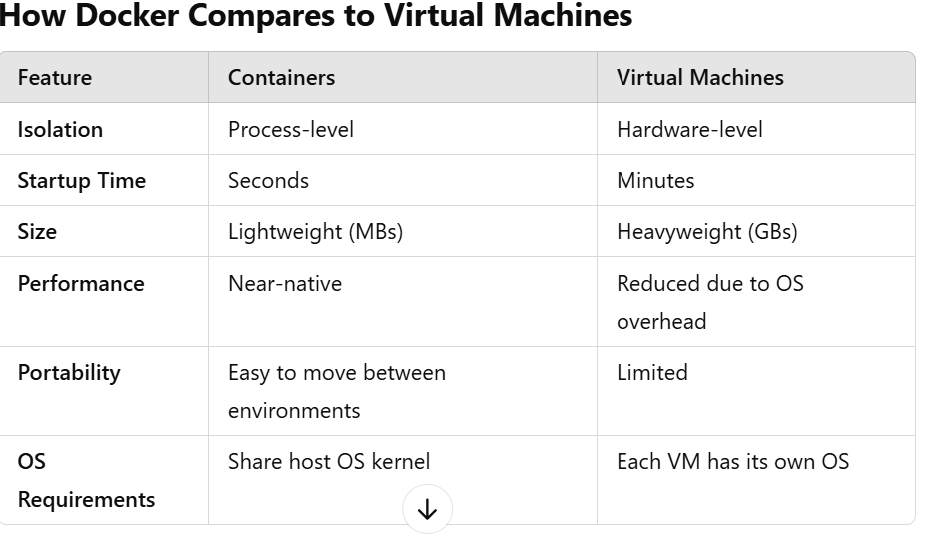

# DOCKER
Docker is a platform for creating, deploying, and managing containerized applications. It helps developers package applications and their dependencies into standardized units, called containers, which are lightweight, portable, and efficient.

# Key Concepts:

# 1. Docker

  Docker is a tool that simplifies the process of running applications in containers.

  It provides an environment where you can build, ship, and run applications consistently across different environments.

# 2. Images
  A Docker image is a lightweight, standalone, and executable package that contains everything needed to run a piece of software, including:

  * Code
  * Runtime
  * System libraries
  * Dependencies
  * Immutable: Once built, images don’t change.

  Example: An image might contain a Python application with Flask and its dependencies.

  * Usage: Images are used to create containers.

* How it works:
  * Think of an image as a blueprint for your application. It describes how the container should be built.

# 3. Containers

A container is a runtime instance of a Docker image. It’s where your application actually runs.

Containers are isolated environments, meaning they don’t interfere with other applications or containers on the same machine.

They are lightweight because they share the host operating system kernel rather than running a full OS for each instance.

Example: A container running a Node.js web app can work alongside another container running a MySQL database, each operating independently.

   # DOCKER.

   ## What is Docker?
Docker is an open-source platform designed to help developers build, deploy, and manage applications in lightweight, portable containers. These containers bundle an application and its dependencies together so that it runs consistently across various computing environments, from local development machines to production servers.

## Key Features of Docker:
1. Portability: Containers run the same regardless of the environment (local, cloud, on-premise).

2. Lightweight: Containers share the host OS kernel, making them more efficient than virtual machines.

3. Isolation: Applications run independently of each other, avoiding conflicts between dependencies or libraries.

4. Version Control: Docker tracks changes to images, allowing you to roll back to previous states.

5. Scalability: Easily scale your applications by creating multiple container instances.

# How Docker Works
### 1 Images:

* A Docker image is the blueprint for a container.

* It includes the application code, libraries, environment variables, and configuration files needed to run the app.

* Images are built layer by layer, which makes them efficient (only changes to layers are updated).

* Images are read-only and stored in registries like Docker Hub or private repositories.

### 2 Containers:
* A container is a running instance of an image.

* Containers are lightweight and isolated environments.

* Developers can start, stop, or delete containers without affecting other containers or the host system.

Example: A container may run a Python app, another a database, and another a frontend web service.

### 3 Docker Engine:
* This is the core of Docker, a client-server application that manages containers.

* It consists of:
Docker Daemon: Runs on the host machine and manages containers, images, networks, and storage.

* Docker CLI (Command-Line Interface): A tool for interacting with the Docker Daemon.

* REST API: Allows communication with Docker programmatically.

### 4 Docker Registries:
* Registries store Docker images.

* Docker Hub: The default public registry.

* Private Registries: Used for proprietary applications.


# Core Components of Docker.

1. Dockerfile:
A text file that contains instructions to build a Docker image.

Each line represents a step in creating the image.

Example of a simple Dockerfile:
```
# Use a base image
FROM python:3.9-slim

# Set working directory
WORKDIR /app

# Copy application code
COPY . .

# Install dependencies
RUN pip install -r requirements.txt

# Define the command to run the app
CMD ["python", "app.py"]
```

2. Images:
* Created by executing a Dockerfile using the docker build command.

* Images can be versioned and shared.

3. Containers:
* Created from images using the docker run command.

* Containers can be started, stopped, and removed.

* Example
`docker run -d -p 5000:5000 my-python-app`

* -d: Run in detached mode (in the background).

* -p: Map container ports to host ports.

4. Docker Compose:
* A tool for defining and running multi-container Docker applications.

* Uses a docker-compose.yml file to configure services, networks, and volumes.

* Example docker-compose.yml:yaml Copy code
```
version: "3.9"
services:
  web:
    build: .
    ports:
      - "5000:5000"
    volumes:
      - .:/app
    environment:
      FLASK_ENV: development
  db:
    image: postgres
    environment:
      POSTGRES_USER: user
      POSTGRES_PASSWORD: password
```

5. Docker Volumes:
* Used to persist data generated by and used in Docker containers.

* Volumes are stored outside the container filesystem, so data isn’t lost when a container is removed.

6. Docker Networking:

* Allows containers to communicate with each other and with the host machine.

* Docker provides several types of networks:

* Bridge: Default network for containers.

* Host: Shares the host's network stack.

* Overlay: For multi-host communication.

* None: Isolated container with no network.

# How Docker Compares to Virtual Machines


### Docker Workflow:

1. Write a Dockerfile to define how your application should be built and run.

2. Use docker build to create an image from the Dockerfile.

3. Use docker run to create a container from the image.

4. Test and debug the containerized application.

5. Push the image to a registry (like Docker Hub) for sharing or deployment.

6. Deploy containers to production, often using orchestration tools like Kubernetes.

# Common Docker Commands:

*  Manage Images:
`docker build -t my-app` .

*  List images:
`docker images`

Remove an image
  `docker rmi my-app`

2. Manage Containers:

* Start a container
  `docker run -it my-app`

* List running containers
`docker ps`

* Stop a container
`docker stop <container_id>`

* Remove a container
`docker rm <container_id>`

3. Docker Compose:

* Start services:
`docker-compose up`

* Stop services:
`docker-compose down`

# Real-World Use Cases for Docker

1. Microservices Architecture:

* Docker simplifies running multiple services (e.g., frontend, backend, and database) in isolated containers.

2. CI/CD Pipelines:

* Docker is integral to Continuous Integration and Deployment, ensuring consistency from development to production.

3. Testing and Debugging:

* Developers can quickly spin up environments to test applications without polluting the host system.

4. Cloud-Native Applications:

* Docker works seamlessly with cloud platforms like AWS, Google Cloud, and Azure.

5. Simplified Development:

* Developers no longer need to worry about system-specific issues; everything is in the container.

# Advanced Docker Concepts

1. Multi-Stage Builds:

* Create lightweight production images by separating build and runtime stages in a Dockerfile.

2. Docker Swarm:

* A native orchestration tool for managing clusters of Docker nodes.

3. Kubernetes Integration:

* Kubernetes is widely used to orchestrate Docker containers in production at scale.


  


