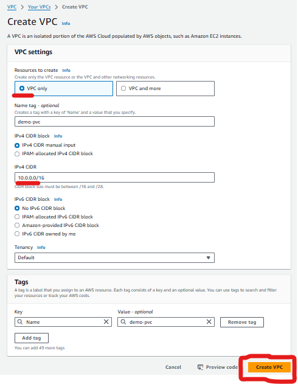
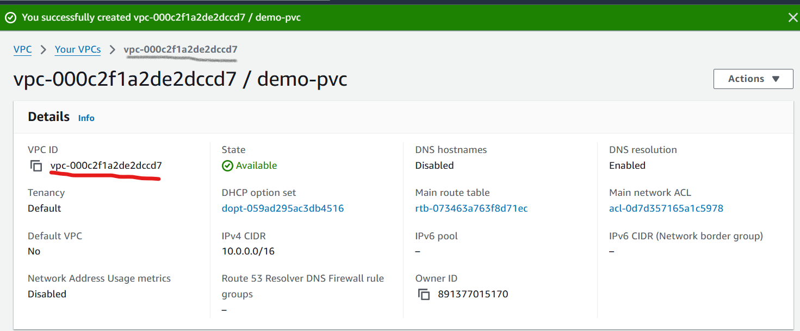
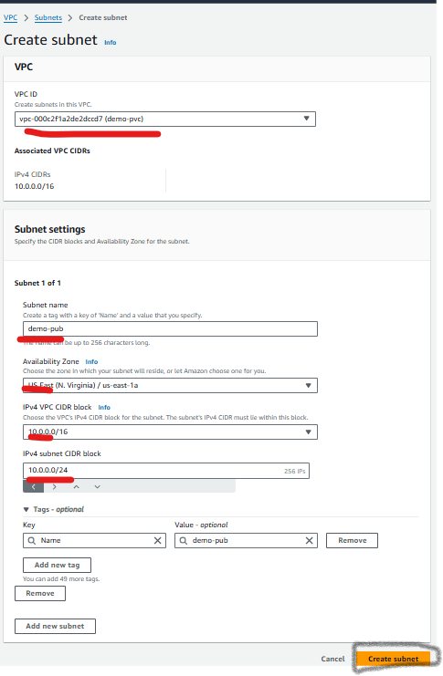
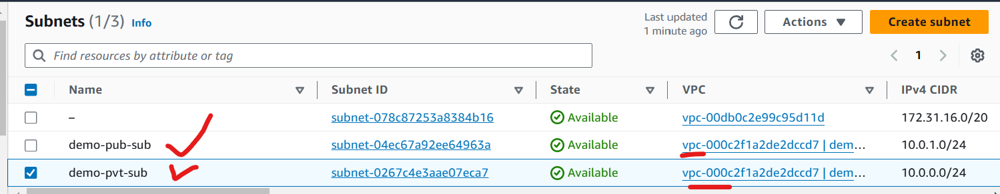
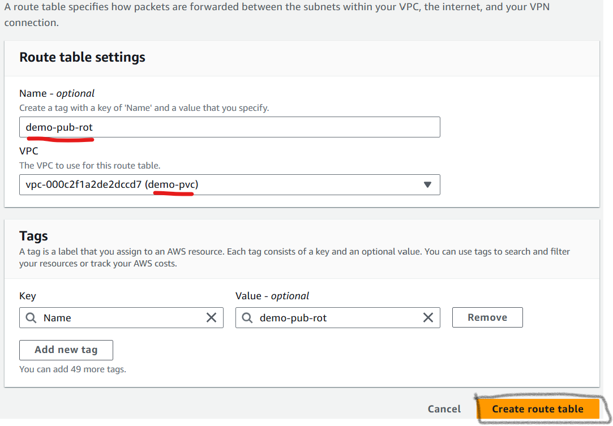
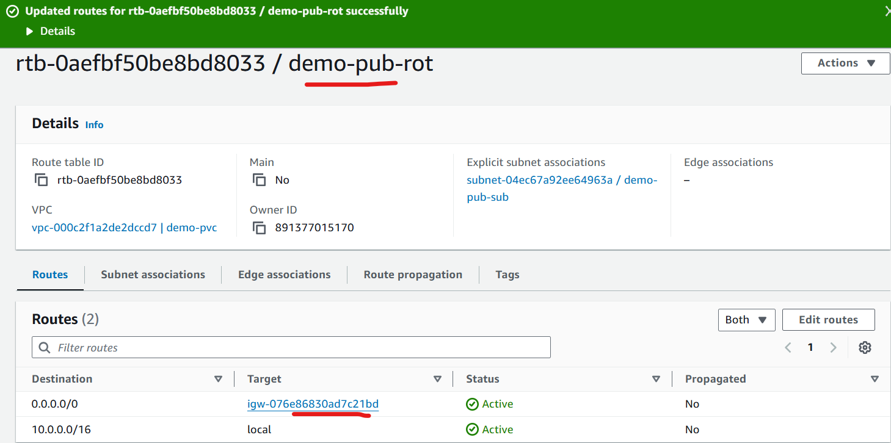
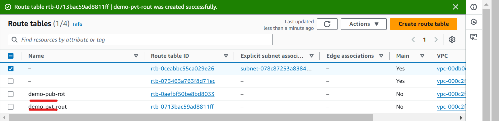
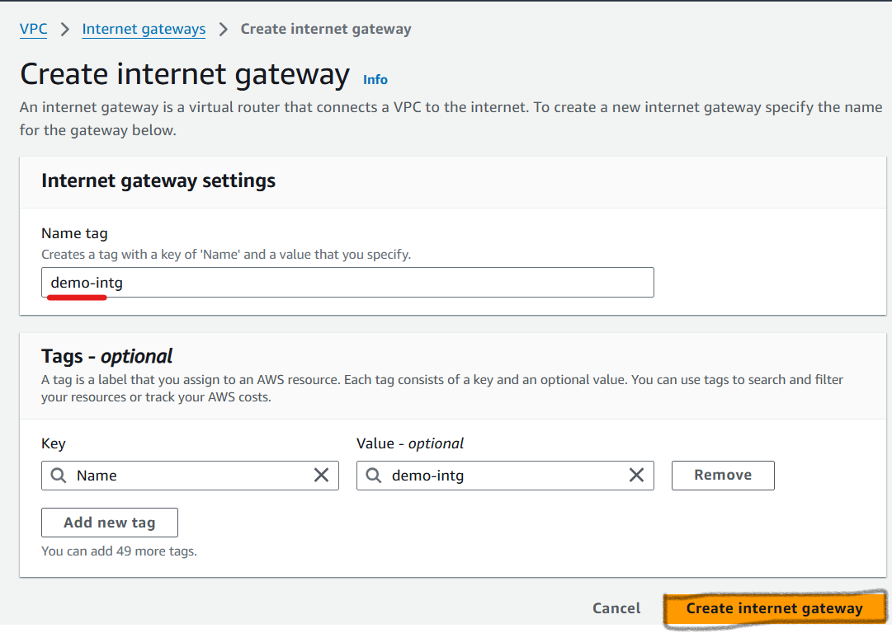
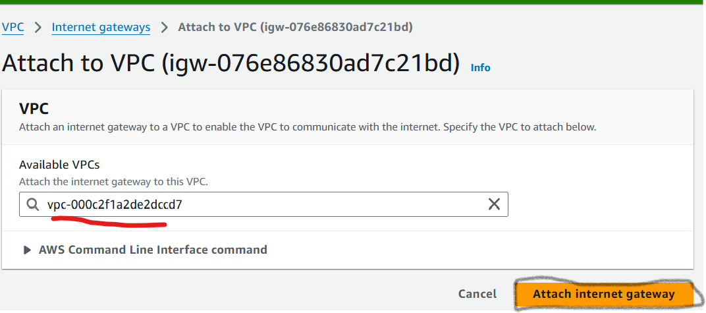

# vpc notes

## With Amazon Virtual Private Cloud (Amazon VPC), you can launch AWS resources in a logically isolated virtual network that you've defined.This virtual network closely resembles a traditional network that you'd operate in your own data center, with the benefits of using the scalable infrastructure of AWS.

**now we have to create a (vpc) Virtual Private Cloud**

**step1 goto aws Console and Navigate to vpc dashboard,create vpc.**
**Click Create VPC. vpc NAME (your VPC for identification).Choose VPC only** 

**Specify a CIDR block (e.g., 10.0.0.0/16) for your VPC.create vpc.**

## now  we have to Create a Subnet.
**In the VPC Console, go to Subnets.Click Create a publicSubnet.Name the subnet (demo-pub-sub)Choose the VPC you created.Specify a CIDR block (10.0.1.0/24 for the subnet).assign it to a specific Availability Zone like us-east-1a.**
**in the same way create a private subnet. next to create.**

## now we have to create a rout tables
**Configure Route Tables. Go to Route Tables in the VPC Console.create a route table for your VPC.Add a route to direct traffic to the Internet Gateway:(ssh)Destination: 0.0.0.0/0. go to public routtable eadit rout atteach to internet gateway. **
**now in the same create a private arout table and click to ctrate **

## now create a Create an Internet Gateway
**internet gateway is a device that connects a network to the internet, allowing devices to communicate with other networks**

**in  the VPC Console, go to Internet Gateways,Clic Create Internet Gateway. name (dem-intg)Name it and attach it to your VPC.VPC ID (vpc-000c2f1a2de2dccd7)**

**we've successfully created a VPC, utilizing subnets, route tables and Internet Gateway. This setup provides a solid understanding of AWS networking components and how to work.**